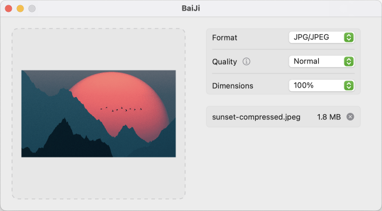

# BaiJi

BaiJi is an efficient format converter and compression tool that minimizes media quality loss.

    

## Features

- Convert any image format, including HEIC, PNG, JPEG, and WebP.
- Crop images based on specific dimensions.
- Support Chinese and English.
